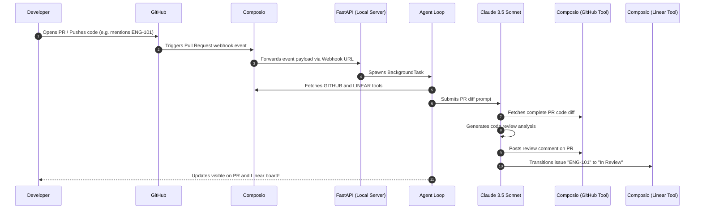

# GitHub PR Review & Linear Synchronization Agent 🚀

A production-ready, fully automated AI code review and issue synchronization agent. Powered by **Composio** and **Anthropic Claude 3.5 Sonnet**, this agent listens for GitHub Pull Request events, performs automated code reviews on new diffs, posts review comments directly on GitHub, and automatically transitions any associated Linear issues to "In Review".

---

## ⚡ Key Value Proposition
Integrating **GitHub** and **Linear** usually requires separate complex apps or rigid automated workflows. This agent shows the power of **Composio's SDK**:
1. **Dynamic Tool Fetching**: Uses Composio to automatically retrieve GitHub and Linear API toolsets within a single developer environment context.
2. **Unified Agent Loop**: Empowers Claude 3.5 Sonnet to autonomously decide which tools to execute, in what order, keeping GitHub reviews and project management boards in lockstep.
3. **Automated Event Webhooks**: Instantly responds to live Git activities via server-side events.

---

## 🏗️ Architecture & Event Flow



---

## ⚙️ Prerequisites & Setup

Ensure you have the following before starting:
- **Python 3.8+** installed.
- **Composio Account**: Sign up at [Composio](https://composio.dev) and grab your API Key.
- **Anthropic API Key**: Access to Claude 3.5 Sonnet.
- **ngrok** (or similar tunneling tool) installed locally to expose your webhook.

---

## 🛠️ Step-by-Step Installation

### 1. Clone & Set Up Environment
First, clone this repository or initialize your project folder, and install dependencies:

```bash
# Create and activate python virtual environment
python3 -m venv venv
source venv/bin/activate

# Install dependencies
pip install -r requirements.txt
```

### 2. Configure Environment Variables
Copy `.env.template` to `.env` and fill in your details:

```bash
cp .env.template .env
```

Edit the `.env` file:
```env
COMPOSIO_API_KEY=your_composio_api_key
ANTHROPIC_API_KEY=your_anthropic_api_key

# Email/ID representing this developer workspace
USER_EMAIL=your_email@domain.com

# Obtain these ac_ prefixes from your Composio Dashboard -> Integrations
GITHUB_AUTH_CONFIG_ID=ac_github_xxxxxx
LINEAR_AUTH_CONFIG_ID=ac_linear_yyyyyy
```

---

## 🔗 How to Connect & Run

### Step 1: Connect Integrations (OAuth Setup)
Run the script to initiate OAuth for your GitHub and Linear workspace. This is done securely using Composio's managed OAuth:

```bash
python setup_auth.py
```
- Open the printed **GitHub** and **Linear** URLs in your browser.
- Authorize your accounts.
- The script will detect the authorization and output a successful completion.

### Step 2: Register GitHub Pull Request Trigger
Register a trigger event for your target repository so that Composio receives PR notifications:

```bash
python setup_trigger.py --owner "your-github-username" --repo "your-repository-name"
```
*Tip: You can also specify `GITHUB_OWNER` and `GITHUB_REPO` in your `.env` file to skip CLI parameters.*

### Step 3: Run the Webhook Server
Start the FastAPI server locally:

```bash
python main.py
```
Your server will start running at `http://localhost:8000`.

### Step 4: Expose Local Webhook Server
Open a separate terminal window and expose port 8000 using ngrok:

```bash
ngrok http 8000
```
Copy the public `https://...ngrok-free.app` URL.

### Step 5: Configure Webhook URL in Composio
1. Go to your **Composio Dashboard** under Project Settings.
2. Paste the public ngrok webhook URL under the **Webhook URL** field (e.g. `https://your-subdomain.ngrok-free.app/webhook/github-pr`).
3. Copy the **Composio Webhook Secret** and save it as `COMPOSIO_WEBHOOK_SECRET` in your `.env` file to enforce validation checks.

---

## 🧪 End-to-End Verification

To test the agent flow:
1. Open a new Pull Request in your configured test repository.
2. In the PR Description, reference a valid Linear issue code (e.g. `Resolves ENG-102` or `Works on ENG-42`).
3. Observe the FastAPI console logs:
   - Webhook intercepts the event immediately.
   - Spawns background thread for the AI agent.
   - Claude fetches the PR diff, reviews the changes, and posts a comment back on GitHub.
   - Claude updates the status of the associated Linear ticket to **In Review**.

---

## 📁 Repository Overview
- `setup_auth.py`: Script to authenticate and connect GITHUB + LINEAR.
- `setup_trigger.py`: CLI script to create GITHUB_PULL_REQUEST_EVENT trigger in Composio.
- `agent.py`: Pure agentic review and synchronization loop using Claude and Composio toolset.
- `webhook.py`: FastAPI endpoint handling incoming webhooks and dispatching agents asynchronously.
- `main.py`: ASGI application entrypoint running the local server.
- `requirements.txt`: Python dependencies.
